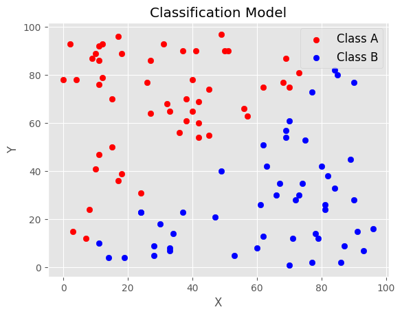
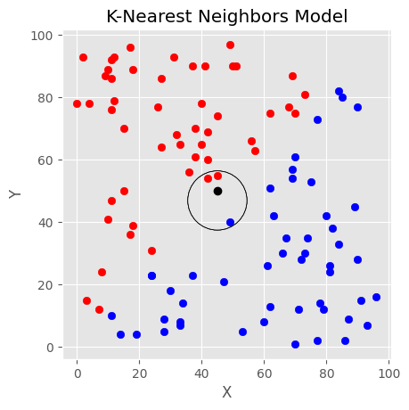

Imagine you had a group of dogs and cats. You weighed each animal and noted the color of their fur, and put all the data in a table. Would you be able to create a model, that given these parameters, could decide if the row was a dog or a cat?

The answer is yes, as this is one of the biggest applications of data science today. This type of model is a **classification model**. The goal of classification models are to assign some input data into different categories, using statistics to make the decisions.

There is a [famous dataset from the University of Wisconsin](<https://archive.ics.uci.edu/ml/datasets/Breast+Cancer+Wisconsin+(Diagnostic)>) that took mass from patients with and without breast cancer, and noted 32 features. We are going to create our own classification model that will be able to predict which patients did and did not have breast cancer. We will be implementing two common models for classification: K-Nearest Neighbors, and Linear Regression.

### How It Works

The K-Nearest Neighbors model is an simple and intuitive model to classify a point. The idea behind it is that similar categories are close together in proximity. We can visualize this with a graph where we know some data points already and which class they belong to:



As you can see, points above the model belong to Class 1, and below to Class 2. Of course, in a real data science problem, we won't have this ideal model, so we have to guess some other way.

Given a point $p$ at $(a,b)$, we can do the following:

- Calculate the distance from every labeled point to $(a,b)$
- Take the $k$ points with the smallest distance
- $p$ belongs to the majority class of these points

We can visualize this by drawing a very small circle around the point, and expanding it until it surrounds $k$ other points. The following shows that example when $k=3$ and $p$ is at $(50, 50)$:



Therefore, in this example, $p$ would belong to Class 1. This is easy to do on a graph, but we need a way to calculate the distance between two points. How will we do it?

#### Calculating Distance

There are 4 commonly used distance metrics in Machine Learning:

- Euclidean Distance
- Manhattan Distance
- Minkowski Distance
- Hamming Distance

We will use the **Euclidean Distance** formula, as it's the simplest. It uses the Pythagorean Theorem to find the distance between a point at $(x_1, y_1)$ and a point at $(x_2, y_2)$:

$d=\sqrt{(x_2 - x_1)^2 + (y_2 - y_1)^2}$

Expanding this to allow for $n$ dimensions is important, because our dataset has 32 features, therefore 32 dimensions. To calculate the distance between two points $x$ and $y$ of $n$ dimensions is:

$d = \sqrt{\sum_{i=1}^{n} (x_i - y_i)^2}$

#### Choosing K

Lastly, we must choose our own $k$ for our model. Remember that $k$ is the number of neighbors we will compare to the point we are trying to classify.

Choosing a low $k$ leads to overfitting, or that noise will have a larger influence on the model. Likewise, choosing a high $k$ leads to underfitting. Therefore, it is critical to get it right

A general rule of thumb for $n$ datapoints is to use $k = \sqrt{n}$. It is also preferred to use an odd number, in the case of tie. For example, if $k = 4$, a possible scenario is that there are two neigbors of Class 1, and two neighbors of Class 2.

### Dataset

|      | present | mean radius | mean texture | mean perimeter | mean area | mean smoothness | mean compactness | mean concavity | mean concave points | mean symmetry | mean fractal dimension | radius error | texture error | perimeter error | area error | smoothness error | compactness error | concavity error | concave points error | symmetry error | fractal dimension error | worst radius | worst texture | worst perimeter | worst area | worst smoothness | worst compactness | worst concavity | worst concave points | worst symmetry | worst fractal dimension |
| ---: | ------: | ----------: | -----------: | -------------: | --------: | --------------: | ---------------: | -------------: | ------------------: | ------------: | ---------------------: | -----------: | ------------: | --------------: | ---------: | ---------------: | ----------------: | --------------: | -------------------: | -------------: | ----------------------: | -----------: | ------------: | --------------: | ---------: | ---------------: | ----------------: | --------------: | -------------------: | -------------: | ----------------------: |
|    0 |       0 |       17.99 |        10.38 |          122.8 |      1001 |          0.1184 |           0.2776 |         0.3001 |              0.1471 |        0.2419 |                0.07871 |        1.095 |        0.9053 |           8.589 |      153.4 |         0.006399 |           0.04904 |         0.05373 |              0.01587 |        0.03003 |                0.006193 |        25.38 |         17.33 |           184.6 |       2019 |           0.1622 |            0.6656 |          0.7119 |               0.2654 |         0.4601 |                  0.1189 |
|    1 |       0 |       20.57 |        17.77 |          132.9 |      1326 |         0.08474 |          0.07864 |         0.0869 |             0.07017 |        0.1812 |                0.05667 |       0.5435 |        0.7339 |           3.398 |      74.08 |         0.005225 |           0.01308 |          0.0186 |               0.0134 |        0.01389 |                0.003532 |        24.99 |         23.41 |           158.8 |       1956 |           0.1238 |            0.1866 |          0.2416 |                0.186 |          0.275 |                 0.08902 |
|    2 |       0 |       19.69 |        21.25 |            130 |      1203 |          0.1096 |           0.1599 |         0.1974 |              0.1279 |        0.2069 |                0.05999 |       0.7456 |        0.7869 |           4.585 |      94.03 |          0.00615 |           0.04006 |         0.03832 |              0.02058 |         0.0225 |                0.004571 |        23.57 |         25.53 |           152.5 |       1709 |           0.1444 |            0.4245 |          0.4504 |                0.243 |         0.3613 |                 0.08758 |
|    3 |       0 |       11.42 |        20.38 |          77.58 |     386.1 |          0.1425 |           0.2839 |         0.2414 |              0.1052 |        0.2597 |                0.09744 |       0.4956 |         1.156 |           3.445 |      27.23 |          0.00911 |           0.07458 |         0.05661 |              0.01867 |        0.05963 |                0.009208 |        14.91 |          26.5 |           98.87 |      567.7 |           0.2098 |            0.8663 |          0.6869 |               0.2575 |         0.6638 |                   0.173 |
|    4 |       0 |       20.29 |        14.34 |          135.1 |      1297 |          0.1003 |           0.1328 |          0.198 |              0.1043 |        0.1809 |                0.05883 |       0.7572 |        0.7813 |           5.438 |      94.44 |          0.01149 |           0.02461 |         0.05688 |              0.01885 |        0.01756 |                0.005115 |        22.54 |         16.67 |           152.2 |       1575 |           0.1374 |             0.205 |             0.4 |               0.1625 |         0.2364 |                 0.07678 |

### Implementation

#### Prerequisites

For this tutorial, you will need a Python 3 installation. I will be using 3.9.9 for this tutorial.

You will also need the following packages installed:

- Sci-Kit Learn
- Numpy
- Pandas

#### Using Sci-Kit Learn

We will quickly go over how to implement this with sci-kit learn, because this is a really easy way to create a classifier.

##### Preparing the data

First, we are going to load the dataset from Sci-Kit Learn, then seperate it into our x and y variables.

```python
from sklearn.datasets import load_breast_cancer

breast_cancer = load_breast_cancer()
x = breast_cancer.data
y = breast_cancer.target
```

Next, we are going to split the data into our test train split.

```python
from sklearn.model_selection import train_test_split

x_train, x_test, y_train, y_test = train_test_split(x, y, random_state=0, stratify=y)

# random_state = 0: set seed to 0, meaning
# that data will be split into test/train
# the same way each time we run the program
#
# stratify = y: preserve the proportion of 
# targets from the original dataset to the
# test/train sets
```

Lastly, we will also calculate the number of data points we have in the dataset to calculate k.

```python
from math import sqrt, floor

n = x.shape[0] # 569
k = floor(sqrt(n)) # 23
```

##### Training the Model

Now, we will pass the training data into the model to train it.

```python
from sklearn.neighbors import KNeighborsClassifier

knn = KNeighborsClassifier(n_neighbors=k)
knn.fit(x_train, y_train)
```

##### Testing the Model

Finally, we can use the model to predict for the test data.

```
y_test_pred = knn.predict(x_test)
```

We now can calculate the score like so.

```python
score = knn.score(x_test, y_test)
print(f'Custom KNN without normalization {score}')
```

This results in a score of 
